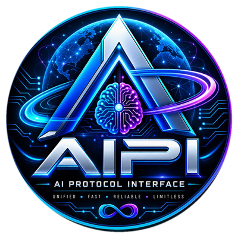
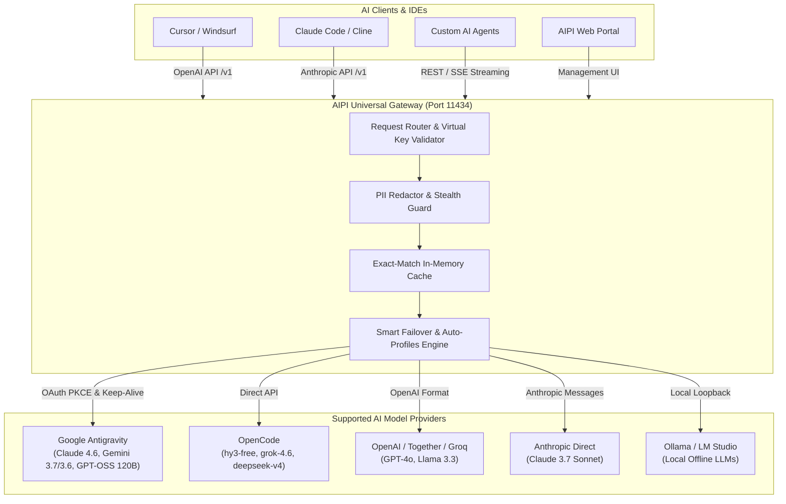

<div align="center">



# 🌐 AIPI — AI Protocol Interface & Model Gateway

### *Universal AI Protocol Interface, Multi-Model Manager & Smart Token Failover Gateway with full support for Antigravity & 189 API providers. Supporting routing for over 50 vibe coding agents.*

[](LICENSE)
[](https://python.org)
[](Dockerfile)
[-success.svg)](test_suite.py)
[]()
[](CONTRIBUTING.md)

---

**Developed by [Ghulam Nabi Kalhoro](https://github.com/gnonymous1)**  
**Copyright © 2026 [gnonymous pvt ltd](https://github.com/gnonymous1). All Rights Reserved.**

---

</div>

## 🏷️ Hashtags & Keywords
`#AIPI` `#MultiModelManager` `#MultiModelRouter` `#APIRouter` `#SimultaneousProviders` `#Fallbacks` `#AutoRotate` `#TokenSaving` `#SmartFailover` `#Antigravity` `#VibeCoding` `#Cursor` `#ClaudeCode` `#GeminiCLI` `#Windsurf` `#Cline` `#RooCode` `#Aider` `#OpenCode` `#189Providers` `#LocalGateway` `#AIAgents` `#OpenSource` `#Python`

---

## 📖 Table of Contents
1. [Overview](#-overview)
2. [Key Capabilities](#-key-capabilities)
3. [50+ Supported Vibe Coding Agents & IDEs](#-50-supported-vibe-coding-agents--ides)
4. [Claude Code & Vibe Agent Profiles Manager](#-claude-code--vibe-agent-profiles-manager)
5. [Dual Operational Modes: Desktop App vs. Web Portal](#-dual-operational-modes-desktop-app-vs-web-portal)
6. [Architecture Overview](#-architecture-overview)
7. [Quick Start Guide](#-quick-start-guide)
8. [Supported Providers & Models (189 API Providers)](#-supported-providers--models-189-api-providers)
9. [Universal Routing & Dynamic Auto-Profiles](#-universal-routing--dynamic-auto-profiles)
10. [Live Quota & Health Monitor](#-live-quota--health-monitor)
11. [Multi-Model Battle Arena](#-multi-model-battle-arena)
12. [Enterprise Security & PII Redaction](#-enterprise-security--pii-redaction)
13. [API Documentation & Usage](#-api-documentation--usage)
14. [1-Click IDE Auto-Configurator](#-1-click-ide-auto-configurator)
15. [Docker Deployment](#-docker-deployment)
16. [Contributing & Community](#-contributing--community)
17. [License](#-license)

---

## 🌟 Overview

**AIPI (AI Protocol Interface)** is a high-performance **Multi-Model Manager**, **Multi-Model Router**, and universal **Smart Token Failover Gateway** with full, out-of-the-box support for **Google Antigravity** and **189 API providers**. It provides seamless, ultra-fast routing for **over 50 vibe coding agents and IDE environments**, including **Claude Code, Cursor, Gemini CLI, Windsurf, Cline, Roo Code, Aider, OpenCode, Continue.dev, Zed, Trae, Void, GitHub Copilot, LibreChat, Goose, Supermaven, Bolt.new, v0, Devin CLI**, and custom autonomous agent swarms.

With AIPI, developers never experience quota outages, rate-limit crashes, or vendor lock-in. Powered by its **Multi-Model Router & Smart Failover Engine**, AIPI continuously monitors upstream provider health, intercepts 429 rate limits, and automatically cascades traffic to healthy fallback models in real time with zero downtime.

---

## ⚡ Key Capabilities

* 🎛️ **Universal Multi-Model Manager**: Organize, test, and manage 189 API providers across enterprise clouds, decentralized GPU clusters, and local model runtimes in one unified dashboard.
* 🤖 **Easy Claude Code & Vibe Coding Profiles Manager**: Full visual profile inspection, 1-click active profile switcher, profile cloning, editing, custom notes, and auto-creation from any of the 189 providers.
* 🚀 **1-Click "Pass to Agent" Spawner**: Instantly pass any API endpoint, credential, or model directly into terminal coding agents (**Claude Code, Cursor, Gemini CLI, Cline, OpenCode, KiloCode, Hermes Agent, Aider**) with pre-injected environment variables.
* 🧪 **Live Model Testing & Benchmark Suite**: Real-time prompt testing with token streaming, latency tracking (ms), USD cost accounting, and side-by-side model comparison.
* ✍️ **Dynamic Profile Editing & Auto-Sync**: Edit, update, and persist custom configurations with live synchronization across local `~/.claude/settings.json`, IDE configs, and gateway routing tables.
* 🛡️ **Multi-Model Router & API Router**: Intelligent request router with explicit provider prefix matching (`antigravity/`, `opencode/`, `openai/`, `anthropic/`), virtual aliases, and automatic fallback cascades.
* ⚡ **Simultaneous Provider Execution**: Query multiple AI cloud providers concurrently in the Multi-Model Battle Arena to evaluate speed, latency, output quality, and cost side-by-side.
* 🔄 **Auto-Rotate & Automatic Fallbacks**: Automatically rotates exhausted accounts and cascades failed requests across backup providers with dynamic 90-second model cooldowns and zero downtime.
* 💾 **Token Saving & In-Memory Exact Cache**: Integrated SHA-256 caching engine that returns instant sub-10ms responses for duplicate prompts, eliminating unnecessary token spend.
* 🚀 **Full Antigravity Support**: Native Google Antigravity OAuth 2.0 PKCE protocol integration, keep-alive tokens, and direct model execution (Claude Sonnet 4.6, Claude Opus 4.6 Thinking, Gemini 3.7/3.6 Flash, GPT-OSS 120B).
* 💻 **50+ Vibe Coding Agents & IDEs**: Instant drop-in compatibility for Cursor, Claude Code, Gemini CLI, Windsurf, Cline, Roo Code, Aider, OpenCode, Continue.dev, Zed, Trae, Void, Copilot, LibreChat, Goose, and more.
* 🔄 **Drop-in Standard Endpoints**: Exposes standard `/v1/chat/completions`, `/v1/models`, and `/v1/messages` compatible with any OpenAI or Anthropic SDK, agent, or IDE.
* 🔋 **Live Real-Time Quota & Health Monitor**: Live percentage bars, health checks, and reset countdowns directly queried from upstream AI clouds.
* 🔐 **Enterprise Vault Key Encryption**: AES-256 vault encryption with PBKDF2 key derivation to securely protect stored provider credentials.
* 🕵️ **PII & Secrets Redaction**: Regex and heuristic masking of emails, API tokens, passwords, credit cards, and sensitive strings with automatic response un-redaction.
* ✈️ **Air-Gapped Stealth Mode**: Blocks outbound internet traffic when local-only compliance is enforced.
* 🔑 **Virtual API Keys & Spend Limits**: Issue tenant/project virtual keys with enforced per-key spend caps, rate limits, and expiration dates.
* 📊 **Cost & Analytics Engine**: Real-time token accounting, USD cost estimation, latency breakdown, and downloadable CSV/Excel reports.
* 🛠️ **1-Click IDE Auto-Configurator**: Instantly generates and injects ready-to-use configuration files for Cursor, Claude Code, Windsurf, Cline, and Roo Code.

---

## 💻 50+ Supported Vibe Coding Agents & IDEs

AIPI functions as the universal local or cloud backend for all modern AI coding agents:

| Category | Supported Agents, IDEs & CLIs | Protocol Used |
| :--- | :--- | :--- |
| **Leading Vibe IDEs** | **Cursor**, **Windsurf**, **Zed**, **Trae**, **Void IDE**, **Positron**, **VSCodium** | OpenAI `/v1/chat/completions` |
| **Terminal & Coding CLIs** | **Claude Code CLI**, **Gemini CLI**, **Aider CLI**, **OpenCode CLI**, **Devin CLI**, **KiloCode**, **Hermes Agent** | Anthropic `/v1/messages` / OpenAI `/v1` |
| **IDE Extensions & Copilots** | **Cline**, **Roo Code**, **Continue.dev**, **GitHub Copilot**, **Supermaven**, **Codeium**, **Amazon Q** | OpenAI / Anthropic Drop-in |
| **Autonomous Agent Frameworks** | **AutoGPT**, **CrewAI**, **LangGraph**, **MetaGPT**, **ChatDev**, **BabyAGI**, **Camel** | Standard OpenAI SDK |
| **Web Dev & UI Builders** | **Bolt.new**, **v0.dev**, **Lovable**, **Replit Agent**, **LibreChat**, **OpenWebUI**, **Big-AGI** | REST / SSE Streaming |
| **Developer Productivity** | **Goose**, **Cursor-Small**, **GPT4All**, **Jan.ai**, **LM Studio**, **Ollama**, **LocalAI** | Local Loopback (`http://127.0.0.1:11434`) |

---

## 🤖 Claude Code & Vibe Agent Profiles Manager

AIPI features a dedicated **Profiles Manager & 1-Click Agent Spawner** that bridges your configured AI model providers with terminal coding CLIs and IDE environments.

```
+----------------------------------------------------------------------------------------------------+
|                             AIPI PROFILES & AGENT DISPATCH PIPELINE                                |
+-----------------------+----------------------------------+-----------------------------------------+
|  1. MODEL TESTING     |  2. PROFILE MANAGEMENT           |  3. 1-CLICK "PASS TO AGENT"             |
|                       |                                  |                                         |
|  * Live Token Stream  |  * Auto-create Claude Profiles   |  * Claude Code CLI (auto-activates)     |
|  * Latency (ms) & Cost|  * Visual Active Profile Status  |  * Cursor / Windsurf Environment        |
|  * Benchmark Ranking  |  * Edit, Rename, & Add Notes     |  * Gemini CLI / OpenCode / KiloCode     |
|  * Side-by-Side Arena |  * Sync with ~/.claude/settings  |  * Cline / Roo Code / Hermes Agent      |
+-----------------------+----------------------------------+-----------------------------------------+
```

### 1. ⚙️ Easy Claude Code Profiles Manager
* **Live Profile Browser**: Instantly reads and displays all profiles configured on your system (`~/.claude/profiles` and `~/.claude/settings.json`).
* **1-Click Active Switching**: Select any profile and click **"Set as Active"** to update Claude Code immediately.
* **Auto-Create Profiles**: Convert any of AIPI's 189 providers into a Claude Code profile with a single click.
* **Edit & Annotate**: Rename profiles, attach customized notes (e.g. rate limit budgets, specialized system prompts), and update endpoints on the fly.

### 2. 🧪 Real-Time Model Testing & Benchmarks
* **Interactive Model Tester**: Select any provider and model, configure temperature and max tokens, and send test prompts.
* **Streaming Tokens**: Watch tokens stream live in real time with precise millisecond latency tracking.
* **Cost & Token Accounting**: View prompt tokens, completion tokens, total tokens, and exact USD cost per request.
* **Benchmark Tab**: Benchmark all models belonging to a provider simultaneously to discover the fastest and most cost-effective models.

### 3. 🚀 1-Click "Pass to Agent" Spawner
* Right inside the Model Tester, use the **Pass to ▾** menu to instantly dispatch the selected provider, URL, API key, and model to your favorite coding tool:
  * **Pass to Claude**: Auto-installs and activates the Claude profile, then spawns a ready-to-code `claude` session.
  * **Pass to Cursor / Windsurf**: Pre-configures environment variables for immediate IDE integration.
  * **Pass to Gemini CLI**: Launches Gemini CLI connected directly to AIPI's Antigravity or Vertex routes.
  * **Pass to Cline / Roo Code**: Injects OpenAI/Anthropic gateway endpoints into extension configs.
  * **Pass to OpenCode / KiloCode / Hermes**: Spawns terminal sessions with zero manual configuration.

---

## 🕹️ Dual Operational Modes: Desktop App vs. Web Portal

AIPI is engineered with **two complementary operational interfaces** suited for both individual developer workstations and production server environments:

```
+-------------------------------------------------------------------------------+
|                               AIPI PLATFORM                                   |
+---------------------------------------+---------------------------------------+
|  🖥️ 1. DESKTOP APPLICATION MODE       |  🌐 2. WEB PORTAL & GATEWAY MODE      |
|     (ai_model_manager.py)             |     (gateway_server.py on :11434)     |
|                                       |                                       |
|  * Native Tkinter GUI & System Tray   |  * Modern Glassmorphism Web App       |
|  * Hotkey Quick Switcher (Ctrl+Alt+M) |  * Universal OpenAI/Anthropic Gateway |
|  * 1-Click "Pass to CLI" Spawner      |  * Multi-Model Battle Arena           |
|  * Direct Claude Profiles Manager     |  * Live Quota & Reset Countdown Bars  |
|  * Live Provider Ping & Benchmarks    |  * Virtual API Keys & Spend Limits    |
|  * Local AES-256 Vault Management     |  * 189-Provider Hub & 1-Click OAuth   |
+---------------------------------------+---------------------------------------+
```

### 🖥️ Mode 1: Desktop Application Mode (`ai_model_manager.py`)
Designed for **local power users and developers** working directly in Windows/Linux/macOS desktop environments.

* **How to Launch**:
  * **Windows**: Double-click `Start AIPI.bat` or run `python ai_model_manager.py`
  * **Desktop Shortcut**: Automatically minimizes to a floating system tray daemon when closed.
* **Core Capabilities**:
  * 🗂️ **Visual Provider Grid**: Add, edit, delete, and test 189+ provider endpoints with real-time status indicators (✔ Connected, ✘ Error, ⏳ Testing).
  * 🤖 **Claude Profiles Manager**: Inspect all profiles configured in `~/.claude/settings.json`, set active profiles, import models, and manage notes.
  * ⚡ **1-Click "Pass to CLI"**: Right-click or use the tester dropdown to spawn pre-authenticated terminal sessions for **Claude Code, Cursor, Gemini CLI, Cline, OpenCode, KiloCode, or Hermes**.
  * ⌨️ **Global Hotkey (`Ctrl+Alt+M`)**: Instantly opens a floating quick model switcher without leaving your IDE.
  * ⏱️ **Model Benchmark Tab**: Run prompt tests across all models belonging to a provider simultaneously and view ranked latency & throughput charts.

---

### 🌐 Mode 2: Web Portal & API Gateway Mode (`gateway_server.py`)
Designed for **centralized team gateways, Docker servers, and high-throughput agent routing**.

* **How to Launch**:
  * Run `python gateway_server.py run 11434` or `docker-compose up -d`
  * Open browser at **`http://127.0.0.1:11434`**
* **Core Capabilities**:
  * 🔌 **189-Provider Hub**: Browse categorized cloud providers (Antigravity, OpenAI, Anthropic, DeepSeek, Groq, Together, Ollama) and trigger **1-Click Google Antigravity OAuth 2.0 PKCE**.
  * ⚔️ **Multi-Model Battle Arena**: Run prompt challenges side-by-side across 2 to 5 models in parallel to evaluate latency (ms), token generation speed, cost ($), and response quality.
  * 🔋 **Live Quota & Health Monitor**: Visual progress bars displaying remaining tokens, requests, and time-to-reset queried directly from upstream cloud APIs.
  * 🔑 **Virtual API Keys Management**: Generate custom `vk-...` tenant tokens with enforced spend limits, rate limits, and allowed model policies.
  * 🎯 **1-Click IDE Setup Center**: Select your IDE (Cursor, Windsurf, Claude Code, Cline, Roo Code) and copy/inject instant configuration files.
  * 🛡️ **PII & Secrets Redaction Engine**: Real-time mask of sensitive API keys, email addresses, credit cards, and social security numbers with automatic response recovery.

---

## 🏗️ Architecture Overview



---

## 🚀 Quick Start Guide

### Prerequisites
* Python 3.10 or higher
* `pip` package manager
* Git

### 1. Clone the Repository
```bash
git clone https://github.com/gnonymous1/AIPI.git
cd AIPI
```

### 2. Install Dependencies
```bash
pip install -r requirements.txt
```

### 3. Launch AIPI
**On Windows:**
Double-click `Start AIPI.bat` or run:
```cmd
python gateway_server.py run 11434
```

**On Linux / macOS:**
```bash
python3 gateway_server.py run 11434
```

### 4. Open the Web Portal
Navigate to [http://127.0.0.1:11434](http://127.0.0.1:11434) in your browser to access the dashboard, playground arena, and configuration center.

---

## 🧩 Supported Providers & Models (189 API Providers)

AIPI includes 189 pre-configured provider integrations, cloud adapters, and local runtimes:

| Provider Tier | Key Supported Models & Endpoints | Authentication | Feature Highlights |
| :--- | :--- | :--- | :--- |
| **Google Antigravity** | `claude-sonnet-4-6`, `claude-opus-4-6-thinking`, `gemini-3.7-flash-high`, `gemini-3.6-flash-medium`, `gemini-2.5-flash`, `gpt-oss-120b-medium` | Google OAuth 2.0 (1-Click) | Multi-endpoint fallback, Reasoning budget, Keep-Alive PKCE |
| **OpenCode Ecosystem** | `hy3-free`, `grok-4.6`, `mimo-v2.5-free`, `deepseek-v4-flash-free`, `nemotron-3-ultra-free` | API Key / Zen Gateway | Ultra-fast, unlimited free models for coding agents |
| **Frontier AI Clouds** | OpenAI (`gpt-4o`, `o3-mini`), Anthropic (`claude-3-7-sonnet`), DeepSeek (`r1`, `v3`), xAI (`grok-2`), Mistral (`large-2`) | API Keys | Full function calling, JSON schema, Extended thinking |
| **High-Throughput Inference** | Groq, Together AI, Cerebras, SambaNova, Fireworks AI, Hyperbolic, Novita AI, DeepInfra, OctoAI | API Keys | Sub-100ms ultra-low latency inference |
| **Enterprise & Multi-Gateways** | Azure OpenAI, AWS Bedrock, Google Cloud Vertex, OpenRouter, Portkey, Helicone, LiteLLM | IAM / Service Keys | Multi-region redundancy & enterprise compliance |
| **100% Offline Local Models** | Ollama, LM Studio, vLLM, Text-Gen-WebUI, Jan.ai, LocalAI (`llama3.3`, `qwen2.5-coder`, `deepseek-r1`) | None (Local) | Zero egress, 100% offline air-gapped stealth mode |

---

## 🎛️ Universal Routing & Dynamic Auto-Profiles

AIPI provides built-in virtual aliases and intelligent auto-profiles that automatically select the fastest and healthiest model:

```json
{
  "auto/best-coding":  ["antigravity/claude-sonnet-4-6", "deepseek-coder", "hy3-free"],
  "auto/best-free":    ["hy3-free", "grok-4.6", "mimo-v2.5-free", "deepseek-v4-flash-free"],
  "auto/best-fast":    ["gemini-3.6-flash-medium", "hy3-free", "grok-4.6"],
  "auto/smart":        ["antigravity/claude-sonnet-4-6", "claude-3-7-sonnet-20250219", "gpt-4o"]
}
```

---

## 🔌 API Documentation & Usage

### 1. Chat Completions (OpenAI Compatible)
```bash
curl http://127.0.0.1:11434/v1/chat/completions \
  -H "Content-Type: application/json" \
  -H "Authorization: Bearer vk-your-virtual-key" \
  -d '{
    "model": "antigravity/claude-sonnet-4-6",
    "messages": [
      {"role": "user", "content": "Explain AIPI architecture in 3 sentences."}
    ],
    "temperature": 0.7,
    "stream": true
  }'
```

### 2. Live Antigravity Quota Check
```bash
curl http://127.0.0.1:11434/v1/providers/antigravity/quota
```

### 3. Anthropic Messages Compatible
```bash
curl http://127.0.0.1:11434/v1/messages \
  -H "Content-Type: application/json" \
  -H "x-api-key: aipi-proxy" \
  -H "anthropic-version: 2023-06-01" \
  -d '{
    "model": "claude-3-7-sonnet-20250219",
    "max_tokens": 1024,
    "messages": [{"role": "user", "content": "Hello AIPI!"}]
  }'
```

---

## 🐳 Docker Deployment

Run AIPI as a lightweight containerized microservice:

```bash
# Build and run with docker-compose
docker-compose up -d --build
```

---

## 🧪 Automated Testing & Verification

AIPI includes a rigorous **18-phase end-to-end verification test suite**:

```bash
python test_suite.py
```

```
======================================================================
AIPI - AI PROTOCOL INTERFACE 100% PRODUCTION VERIFICATION SUITE
Developed by Ghulam Nabi Kalhoro | Copyright (c) 2026 gnonymous pvt ltd.
======================================================================
[SUCCESS] ALL 18 TEST PHASES PASSED WITH 100% SUCCESS!
======================================================================
```

---

## 🤝 Contributing & Community

Contributions are warmly welcomed! We are actively looking for contributors to help expand providers, optimize routing algorithms, and enhance agent integrations.

Please read our [Contributing Guidelines](CONTRIBUTING.md) and [Code of Conduct](CODE_OF_CONDUCT.md) before submitting pull requests.

1. **Fork the Project**
2. **Create your Feature Branch** (`git checkout -b feature/AmazingFeature`)
3. **Commit your Changes** (`git commit -m 'Add some AmazingFeature'`)
4. **Push to the Branch** (`git push origin feature/AmazingFeature`)
5. **Open a Pull Request**

---

## 🛡️ Security Policy

To report security vulnerabilities or private issues, please review our [Security Policy](SECURITY.md).

---

## 📄 License

Distributed under the **MIT License**. See [`LICENSE`](LICENSE) for more information.

**Developed with ❤️ by [Ghulam Nabi Kalhoro](https://github.com/gnonymous1)**  
**Copyright © 2026 gnonymous pvt ltd. All Rights Reserved.**
