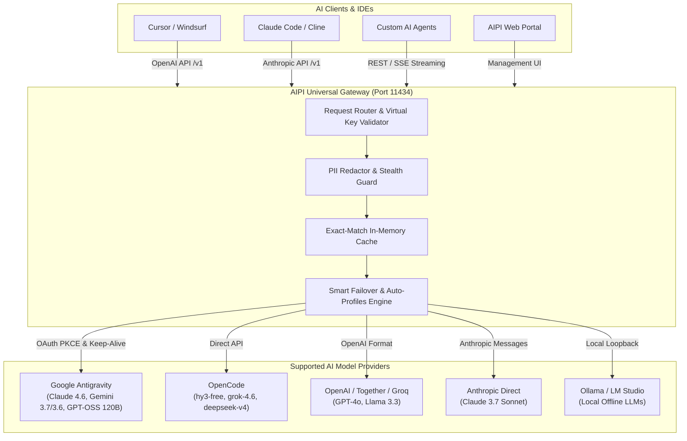

<div align="center">

# 🌐 AIPI — AI Protocol Interface & Model Gateway

### *Universal Multi-Model Gateway, Smart Token Failover & Enterprise Infrastructure for AI Agents*

[](LICENSE)
[](https://python.org)
[](Dockerfile)
[-success.svg)](test_suite.py)
[]()
[](CONTRIBUTING.md)

---

**Developed by [Ghulam Nabi Kalhoro](https://github.com/gnonymous1)**  
**Copyright © 2026 [gnonymous pvt ltd](https://github.com/gnonymous1). All Rights Reserved.**

---

</div>

## 🏷️ Hashtags & Keywords
`#AIPI` `#AIGateway` `#AIModelManager` `#LLMRouting` `#MultiModel` `#OpenAI` `#Anthropic` `#Claude` `#Gemini` `#DeepSeek` `#Ollama` `#OpenCode` `#Antigravity` `#PrivacyFirst` `#PIIMasking` `#LocalGateway` `#AIAgents` `#OpenSource` `#DevOps` `#Python`

---

## 📖 Table of Contents
1. [Overview](#-overview)
2. [Key Capabilities](#-key-capabilities)
3. [Architecture Overview](#-architecture-overview)
4. [Quick Start Guide](#-quick-start-guide)
5. [Supported Providers & Models](#-supported-providers--models)
6. [Universal Routing & Dynamic Auto-Profiles](#-universal-routing--dynamic-auto-profiles)
7. [Live Quota & Health Monitor](#-live-quota--health-monitor)
8. [Multi-Model Battle Arena](#-multi-model-battle-arena)
9. [Enterprise Security & PII Redaction](#-enterprise-security--pii-redaction)
10. [API Documentation & Usage](#-api-documentation--usage)
11. [1-Click IDE Auto-Configurator](#-1-click-ide-auto-configurator)
12. [Docker Deployment](#-docker-deployment)
13. [Contributing & Community](#-contributing--community)
14. [License](#-license)

---

## 🌟 Overview

**AIPI (AI Protocol Interface)** is a high-performance **Multi-Model Manager** and universal **Multiple Models Router with Enhanced Fixations** designed to connect all modern AI coding agents, IDE extensions, CLI tools, and web apps (such as Cursor, Windsurf, Claude Code, Cline, Roo Code, LibreChat, OpenCode, VS Code) to **any LLM provider** through a unified, ultra-fast OpenAI/Anthropic-compatible endpoint.

With AIPI, developers never experience quota outages, rate-limit crashes, or vendor lock-in. Powered by its **Multiple Models Router with Enhanced Fixations**, AIPI continuously monitors upstream provider health, intercepts 429 rate limits, and automatically cascades traffic to healthy fallback models in real time with zero downtime.

---

## ⚡ Key Capabilities

* 🎛️ **Universal Multi-Model Manager**: Manage 150+ AI cloud providers (OpenAI, Anthropic, Google Antigravity, DeepSeek, Groq, Together, OpenRouter) and local models (Ollama, LM Studio) in one unified dashboard.
* 🛡️ **Multiple Models Router with Enhanced Fixations**: Zero-downtime routing engine featuring auto-healing error recovery, dynamic token failover, 90-second smart cooldowns, and automatic provider cascading.
* 🔄 **Drop-in Standard Endpoints**: Exposes standard `/v1/chat/completions`, `/v1/models`, and `/v1/messages` compatible with any OpenAI or Anthropic SDK, agent, or IDE.
* 🔋 **Live Real-Time Quota & Health Monitor**: Live percentage bars, health checks, and reset countdowns directly queried from upstream AI clouds.
* 🔐 **Enterprise Vault Key Encryption**: AES-256 vault encryption with PBKDF2 key derivation to securely protect stored provider credentials.
* ⚔️ **Multi-Model Battle Arena**: Side-by-side prompt execution to benchmark speed, latency, output quality, and cost across multiple models simultaneously.
* 🕵️ **PII & Secrets Redaction**: Regex and heuristic masking of emails, API tokens, passwords, credit cards, and sensitive strings with automatic response un-redaction.
* ✈️ **Air-Gapped Stealth Mode**: Blocks outbound internet traffic when local-only compliance is enforced.
* 🔑 **Virtual API Keys & Spend Limits**: Issue tenant/project virtual keys with enforced per-key spend caps, rate limits, and expiration dates.
* 📊 **Cost & Analytics Engine**: Real-time token accounting, USD cost estimation, latency breakdown, and downloadable CSV/Excel reports.
* 🛠️ **1-Click IDE Auto-Configurator**: Instantly generates and injects ready-to-use configuration files for Cursor, Claude Code, Windsurf, Cline, and Roo Code.

---

## 🏗️ Architecture Overview



---

## 🚀 Quick Start Guide

### Prerequisites
* Python 3.10 or higher
* `pip` package manager
* Git

### 1. Clone the Repository
```bash
git clone https://github.com/gnonymous1/AIPI.git
cd AIPI
```

### 2. Install Dependencies
```bash
pip install -r requirements.txt
```

### 3. Launch AIPI
**On Windows:**
Double-click `Start AIPI.bat` or run:
```cmd
python gateway_server.py run 11434
```

**On Linux / macOS:**
```bash
python3 gateway_server.py run 11434
```

### 4. Open the Web Portal
Navigate to [http://127.0.0.1:11434](http://127.0.0.1:11434) in your browser to access the dashboard, playground arena, and configuration center.

---

## 🧩 Supported Providers & Models

| Provider | Supported Models | Authentication | Feature Highlights |
| :--- | :--- | :--- | :--- |
| **Google Antigravity** | `claude-sonnet-4-6`, `claude-opus-4-6-thinking`, `gemini-3.7-flash-high`, `gemini-3.6-flash-medium`, `gemini-2.5-flash`, `gpt-oss-120b-medium` | Google OAuth 2.0 (1-Click) | Multi-endpoint fallback, Reasoning budget |
| **OpenCode** | `hy3-free`, `grok-4.6`, `mimo-v2.5-free`, `deepseek-v4-flash-free`, `nemotron-3-ultra-free` | API Key | Ultra-fast, unlimited free models |
| **OpenAI** | `gpt-4o`, `gpt-4o-mini`, `o1`, `o3-mini` | API Key | Function calling, JSON mode |
| **Anthropic** | `claude-3-7-sonnet-20250219`, `claude-3-5-sonnet-20241022`, `claude-3-5-haiku` | API Key | Extended thinking, Vision |
| **Ollama Local** | `llama3.3`, `qwen2.5-coder`, `deepseek-r1`, `mistral` | None (Local) | 100% Offline, zero data egress |

---

## 🎛️ Universal Routing & Dynamic Auto-Profiles

AIPI provides built-in virtual aliases and intelligent auto-profiles that automatically select the fastest and healthiest model:

```json
{
  "auto/best-coding":  ["antigravity/claude-sonnet-4-6", "deepseek-coder", "hy3-free"],
  "auto/best-free":    ["hy3-free", "grok-4.6", "mimo-v2.5-free", "deepseek-v4-flash-free"],
  "auto/best-fast":    ["gemini-3.6-flash-medium", "hy3-free", "grok-4.6"],
  "auto/smart":        ["antigravity/claude-sonnet-4-6", "claude-3-7-sonnet-20250219", "gpt-4o"]
}
```

---

## 🔌 API Documentation & Usage

### 1. Chat Completions (OpenAI Compatible)
```bash
curl http://127.0.0.1:11434/v1/chat/completions \
  -H "Content-Type: application/json" \
  -H "Authorization: Bearer vk-your-virtual-key" \
  -d '{
    "model": "antigravity/claude-sonnet-4-6",
    "messages": [
      {"role": "user", "content": "Explain AIPI architecture in 3 sentences."}
    ],
    "temperature": 0.7,
    "stream": true
  }'
```

### 2. Live Antigravity Quota Check
```bash
curl http://127.0.0.1:11434/v1/providers/antigravity/quota
```

### 3. Anthropic Messages Compatible
```bash
curl http://127.0.0.1:11434/v1/messages \
  -H "Content-Type: application/json" \
  -H "x-api-key: aipi-proxy" \
  -H "anthropic-version: 2023-06-01" \
  -d '{
    "model": "claude-3-7-sonnet-20250219",
    "max_tokens": 1024,
    "messages": [{"role": "user", "content": "Hello AIPI!"}]
  }'
```

---

## 🐳 Docker Deployment

Run AIPI as a lightweight containerized microservice:

```bash
# Build and run with docker-compose
docker-compose up -d --build
```

---

## 🧪 Automated Testing & Verification

AIPI includes a rigorous **18-phase end-to-end verification test suite**:

```bash
python test_suite.py
```

```
======================================================================
AIPI - AI PROTOCOL INTERFACE 100% PRODUCTION VERIFICATION SUITE
Developed by Ghulam Nabi Kalhoro | Copyright (c) 2026 gnonymous pvt ltd.
======================================================================
[SUCCESS] ALL 18 TEST PHASES PASSED WITH 100% SUCCESS!
======================================================================
```

---

## 🤝 Contributing & Community

Contributions are warmly welcomed! We are actively looking for contributors to help expand providers, optimize routing algorithms, and enhance agent integrations.

Please read our [Contributing Guidelines](CONTRIBUTING.md) and [Code of Conduct](CODE_OF_CONDUCT.md) before submitting pull requests.

1. **Fork the Project**
2. **Create your Feature Branch** (`git checkout -b feature/AmazingFeature`)
3. **Commit your Changes** (`git commit -m 'Add some AmazingFeature'`)
4. **Push to the Branch** (`git push origin feature/AmazingFeature`)
5. **Open a Pull Request**

---

## 🛡️ Security Policy

To report security vulnerabilities or private issues, please review our [Security Policy](SECURITY.md).

---

## 📄 License

Distributed under the **MIT License**. See [`LICENSE`](LICENSE) for more information.

**Developed with ❤️ by [Ghulam Nabi Kalhoro](https://github.com/gnonymous1)**  
**Copyright © 2026 gnonymous pvt ltd. All Rights Reserved.**
